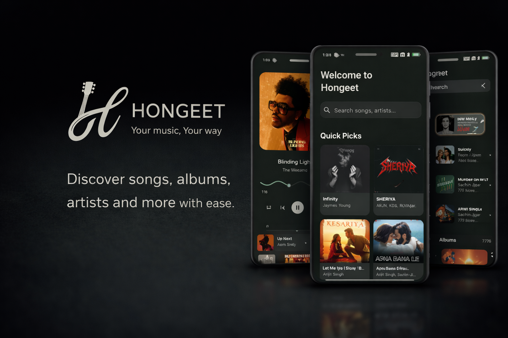
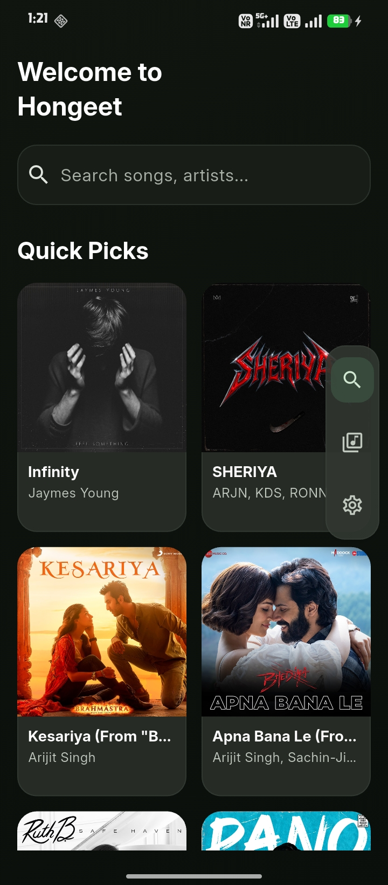
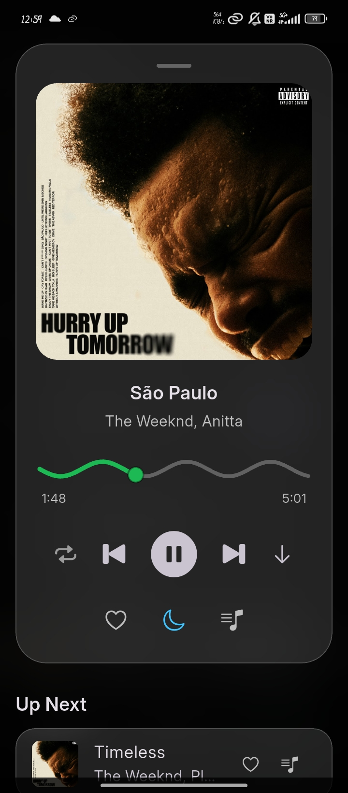
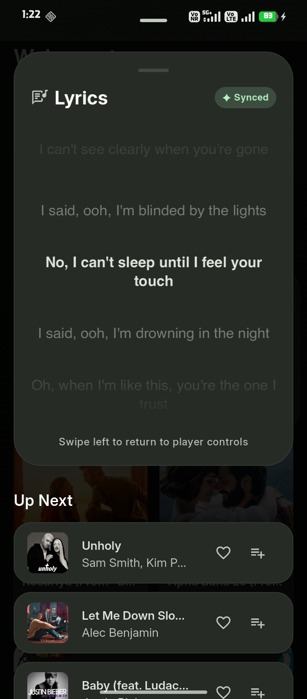
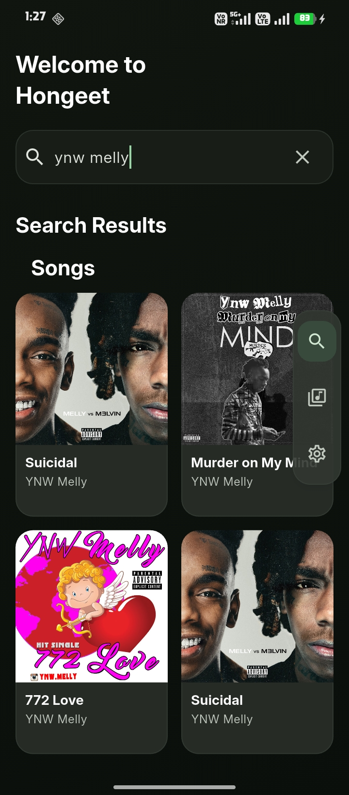
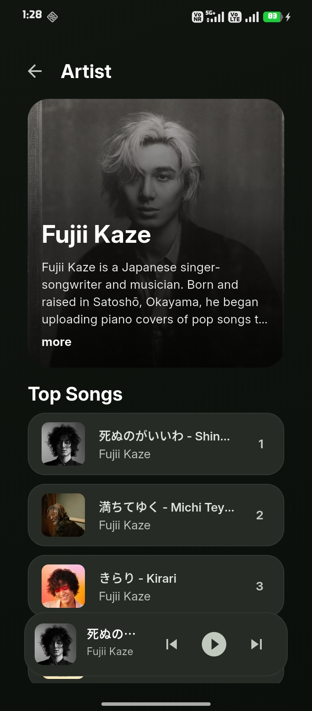
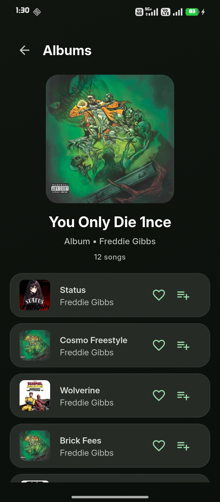

  

  # HONGEET - সংগীত 🎧

  **A lightweight music player with offline playback and optional third-party streaming.** 
  *Built with love for speed, control, and clean design.*

  

    
  

  
   
  
  

   

  
  &nbsp;&nbsp;
  

---

> [!IMPORTANT]
> **Active Development:** Hongeet is currently in active development. Expect bugs, crashes, or missing features.  
> If you encounter issues, please report them in the [Issues Tab](https://github.com/greenbugx/Hongeet/issues).

---

<h1 align=center> 📖 What is HONGEET? </h1>

**HONGEET** was built to solve a simple problem:  
> *“Why is it so hard to just listen to music the way **I** want?”*

Most modern music apps lock downloads behind paywalls, track your data aggressively, or break completely when you go offline. **HONGEET does the opposite.**

Hongeet is a music player that supports **offline local audio playback** and **optional streaming from third-party services such as YouTube Music and JioSaavn** — giving you full control over how and where you listen.

### ✨ Key Highlights
| 🎶 Streaming | 📥 Downloads |
| :--- | :--- |
| • High-quality audio streaming from supported services • Smart URL caching (fast repeats) • Gapless playback & Queue management | • Download directly to device storage • YT Extraction (via `youtube_explode_dart`) • Fully offline playback |

| 🧠 Smart Playback | 🖤 UI / UX |
| :--- | :--- |
| • History & Recents • Loop modes (Off / All / One) • Background playback service | • Glassmorphism-inspired design • Smooth animations • Full-screen & Mini player support |

---

<h2 align=center> 📸 Screenshots </h2>

  <table>
    <tr>
      <td></td>
      <td></td>
      <td></td>
    </tr>
    <tr>
      <td></td>
      <td></td>
      <td></td>
    </tr>
  </table>

---

## 🔐 Permissions

HONGEET asks for permissions strictly needed for playback, downloads, and local media access.

| Permission | Reason |
| :--- | :--- |
| `INTERNET` | For streaming audio, metadata fetching, and optional update checks. |
| `POST_NOTIFICATIONS`  *(Android 13+)* | For playback controls in notification/lock screen and download notifications. |
| `FOREGROUND_SERVICE` `FOREGROUND_SERVICE_MEDIA_PLAYBACK` `WAKE_LOCK` | To keep background playback stable while the app is minimized or the screen is locked. |
| `FOREGROUND_SERVICE_DATA_SYNC` | To support background data tasks such as download/stream sync operations. |
| `READ_MEDIA_AUDIO` *(Android 13+)* | To read audio files from device storage (downloads/local tracks). |
| `READ_EXTERNAL_STORAGE` *(Android 12 and below)* | Backward-compatible local audio access on older Android versions. |
| `REQUEST_IGNORE_BATTERY_OPTIMIZATIONS` | **Optional:** Used to open battery optimization settings on aggressive OEM devices. |
| `MANAGE_EXTERNAL_STORAGE` *(Android 11+)* | **Optional:** Used only if the user opts in to manage local audio/downloaded songs directly from the app. |

> [!NOTE]
> HONGEET **does not** request contacts, location, microphone, or camera permissions.

---

## 🤝 Contributing

Contributions are welcome! Whether it's fixing bugs, improving the UI, or optimizing performance.

1.  **Fork** the repository.
2.  **Create** a feature branch.
3.  **Commit** clean, meaningful changes.
4.  **Open** a Pull Request.

_For detailed info, please check [CONTRIBUTING.md](CONTRIBUTING.md)_

---

## ❤️ Credits & Tech Stack

This project wouldn’t exist without these amazing open-source libraries:

* **youtube_explode_dart** — YouTube stream extraction in pure Dart  
* **JioSaavn API (Unofficial)** — metadata & streaming access from JioSaavn

---

> [!WARNING]
> **Disclaimer:** Hongeet is a personal project built for learning. It is not intended for commercial use. **Do not use this app to distribute copyrighted content.** If you are a rights holder and believe an issue exists, please open an issue immediately.

---

  ## 📜 License
  *Licensed under GNU-AGPLv3.* [View License](LICENSE)

   

  

    

  *Now don't cry listening to sad songs :)*

